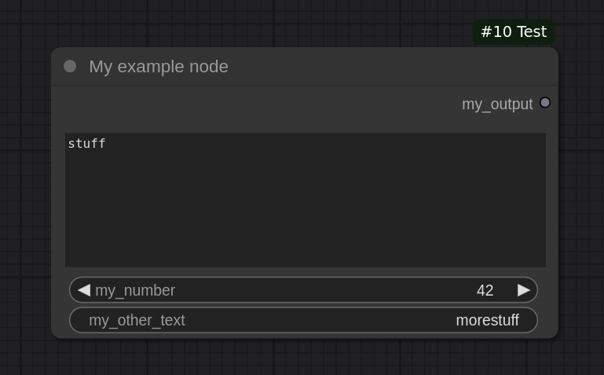

# Example 1: Basics

The following code creates a dummy node for demonstration purposes:

```python
import comfyui_types as ct


class ExampleNode(ct.ComfyUINode):
    """An example node."""

    category = 'My category'
    display_name = 'My example node'
    output_node = True

    # Inputs
    my_text = ct.StringInput(default='stuff', multiline=True)
    my_other_text = ct.StringInput(required=False, default='morestuff')
    my_number = ct.IntegerInput(default=42, min=0, max=100)

    # Outputs
    my_output = ct.StringOutput()

    def execute(self, my_text: str, my_other_text: str, my_number: int) -> str:
        """The function that will be executed, when this node is run."""
        return (f'{my_text} {my_other_text} {my_number}',)


NODE_CLASS_MAPPINGS, NODE_DISPLAY_NAME_MAPPINGS = ct.export_nodes([
    ExampleNode,
])
```



While not useful, this demonstrates most things that are possible with
`comfyui-types`:

- Defining meta attributes like `category` in a consistent way.
- Defining inputs and outputs with full type support and annotations for all
optional parameters.
- Easily exporting nodes for ComfyUI using the already defined properties like
`display_name`.

This node is then automatically picked up by ComfyUI, when placed inside a
folder in `custom_nodes`. Check [example 3](/examples/example_3.md) for an
example how to convert a traditional node to a typed one.
