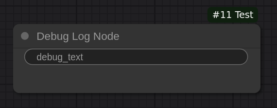

# Example 2: Debugging node

The following code creates a simple node that helps with debugging:

```python
import logging
import comfyui_types as ct


class DebugLogNode(ct.ComfyUINode):
    display_name = 'Debug Log Node'
    output_node = True

    debug_text = ct.StringInput()

    def execute(self, debug_text: str) -> tuple[()]:
        logging.info(debug_text)
        return ()


NODE_CLASS_MAPPINGS, NODE_DISPLAY_NAME_MAPPINGS = ct.export_nodes([
    DebugLogNode,
])
```



This node simply logs any text input to the terminal.
