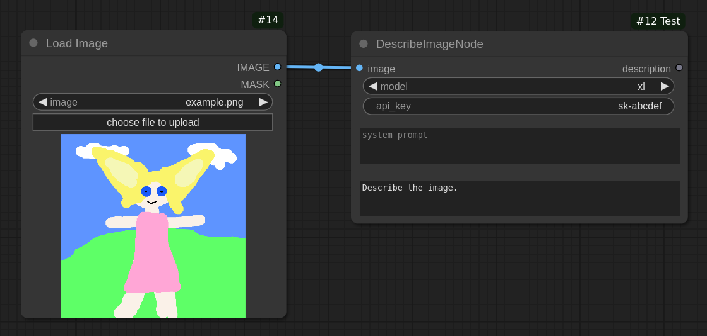

# Example 3: Describe an image via a Vision API

The following custom node provides a way of describing a given input image with
Claude's vision API. It is taken straight from
[ComfyUI-Claude](https://github.com/tkreuziger/comfyui-claude). The actual node
part is abstract enough that it could be swapped out with any other cloud
provider.

## Traditional version

This is how we traditionally define a custom node for ComfyUI:

```python
class DescribeImageNode:
    @classmethod
    def INPUT_TYPES(cls):
        return {
            'required': {
                'image': ('IMAGE',),
                'model': (models,),
                'api_key': ('STRING',),
            },
            'optional': {
                'system_prompt': ('STRING', {'multiline': True}),
                'prompt': ('STRING', {
                    'default': 'Describe the image.',
                    'multiline': True
                }),
            }
        }

    RETURN_TYPES = ('STRING',)
    RETURN_NAMES = ('description',)
    FUNCTION = 'excecute'

    def excecute(
            self,
            image,
            model: str,
            api_key: str,
            system_prompt: str,
            prompt: str
    ):
        return (describe_image(image, prompt, system_prompt, model, api_key),)
```

Nothing special is going on here, we are simply defining a few input fields, an
output, and the method that will be run, when the node is executed. Any actual
implementation logic is handled elsewhere as it is not relevant to the node
itself.

## Version with typing

This is how we could rewrite it with typing. Both nodes are functionally
identical and will look the same to ComfyUI.

```python
class DescribeImageNode(ComfyUINode):
    image = ImageInput()
    model = ChoiceInput(choices=models)
    api_key = StringInput()

    system_prompt = StringInput(required=False, multiline=True)
    prompt = StringInput(
        required=False, multiline=True, default='Describe the image.')

    description = StringOutput()

    def excecute(
            self,
            image,
            model: str,
            api_key: str,
            system_prompt: str,
            prompt: str
    ):
        return (describe_image(image, prompt, system_prompt, model, api_key),)
```

This solution is a bit shorter, but while typing, your IDE will help you create
valid fields with correct parameters.



Both versions can be exported with the same handy "macro" within your
`__init__.py` file:

```python
NODE_CLASS_MAPPINGS, NODE_DISPLAY_NAME_MAPPINGS = export_nodes([
    DescribeImageNode,
])
```
